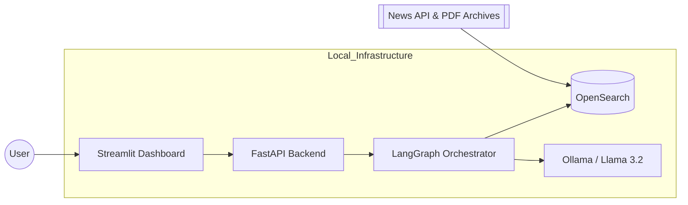
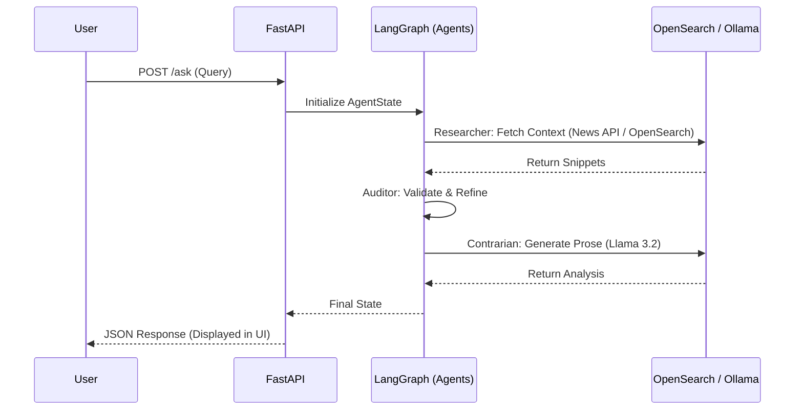

# ⚖️ Contrarian: The Agentic Editorial Curator

**Stop the Echo Chamber.** Most AI is engineered to find the consensus; *Contrarian* is designed to challenge it. Using a multi-agent RAG pipeline, this system retrieves data from global archives via the News API and generates non-consensus, analytical viewpoints — surfacing the "hidden resilience" or "unseen risk" in any global topic.

---

## 📺 Demo

[![Contrarian AI Demo] (docs/Demo.gif)

> **Note:** The demo showcases the Agentic reasoning trace — watch the Researcher, Auditor, and Contrarian nodes tick through in real time, with live latency metrics for local Llama 3.2 inference.

---

## 🚀 The Vision

In an era of algorithmic bias, *Contrarian* acts as a digital advocate. It doesn't just summarize the news — it audits the status quo and formulates non-obvious analytical takes grounded in real data.

> *"Most AI echoes the consensus. I built this to find the hidden resilience."*

---

## 🧩 System Architecture & Logic

### System Context Diagram

This diagram defines the system boundary and shows how Contrarian interacts with the external data ecosystem.



---

### Sequential Flow

The lifecycle of a single user request, showing the hand-off between specialized agents.



---

### How the Nodes Work as Agents

Each node in the LangGraph state machine acts as a **specialized agent** with a distinct persona, responsibility, and system prompt:

| Node | Persona | Responsibility |
|:---|:---|:---|
| **Researcher** | Information Gatherer | Queries OpenSearch via vector similarity to retrieve the most relevant News API / PDF snippets |
| **Auditor** | Quality Controller | Scans retrieved context for consensus bias; refines the objective before inference |
| **Contrarian** | Writer / Analyst | Uses Llama 3.2 to synthesize a final, non-obvious analytical response grounded in the retrieved data |

This is not a single-prompt chatbot — it is a modular, agentic orchestration layer where each specialist can be improved independently.

---

### Data Flow: Ingestion vs. Execution

| Phase | When it runs | What happens |
|:---|:---|:---|
| **Ingestion** | Once / periodically (batch job) | News API articles and PDFs are chunked, vectorized, and indexed into OpenSearch |
| **Execution** | Every user query | The Researcher node performs a vector similarity search against the existing index; no re-indexing occurs |

> **Key design choice:** Separating ingestion from inference ensures user queries only trigger a fast retrieval lookup, not a full re-index — minimising pipeline latency.

---

## 🛠️ Tech Stack

| Component | Technology |
|:---|:---|
| Multi-Agent Orchestration | [LangGraph](https://github.com/langchain-ai/langgraph) |
| LLM (Local, Zero-Cost) | [Ollama](https://ollama.com/) — Llama 3.2 |
| Vector Database | [OpenSearch](https://opensearch.org/) |
| API Layer | [FastAPI](https://fastapi.tiangolo.com/) + Uvicorn |
| Frontend Dashboard | [Streamlit](https://streamlit.io/) (Deep Carbon Dark Mode) |
| Data Ingestion | News API + PDF Archives |
| Containerisation | Docker (OpenSearch) |

---

## ⚡ Quick Start

### Prerequisites

- [Ollama](https://ollama.com/) installed and running locally
- Docker (for the OpenSearch container)
- Python 3.11+

### 1. Clone & Install

```bash
git clone https://github.com/your-username/contrarian.git
cd contrarian
pip install -r requirements.txt
```

### 2. Configure Environment

Copy the example env file and add your News API key (optional):

```bash
cp .env.example .env
```

### 3. Pull the LLM

```bash
ollama pull llama3.2
```

### 4. Start OpenSearch (Docker)

```bash
docker-compose up -d
```

### 5. Run the Backend

```bash
set PYTHONPATH=%cd%
uvicorn app.api.main:api --reload
```

### 6. Launch the Dashboard

Open a second terminal:

```bash
streamlit run app/ui/dashboard.py
```

Navigate to `http://localhost:8501` and enter your analysis query.


#### 💡 Example Queries to Try

```
Based on recent Economist data in my index, what is a contrarian take on the current stability of global supply chains?
```

```
Based on recent Economist data in my index, what is a contrarian take on the current wave of layoffs that are being attributed to AI?
```

---

## 📁 Project Structure

```
contrarian/
├── app/
│   ├── api/
│   │   └── main.py          # FastAPI endpoints
│   ├── agents/
│   │   └── supervisor.py    # LangGraph nodes & AgentState
│   └── ui/
│       └── dashboard.py     # Streamlit dark mode dashboard
├── docs/
│   └── architecture.png     # Static architecture assets
├── data/
│   ├── raw/                 # (gitignored) Raw ingested data
│   └── processed/           # (gitignored) Vectorised output
├── .env.example
├── .gitignore
├── docker-compose.yml
├── requirements.txt
└── README.md
```

---

## 🛡️ Limitations

1. **Inference Latency:** Running Llama 3.2 on local CPU can result in high response times (>120s) for complex, context-heavy queries. This is a trade-off of the zero-cost, local-first deployment strategy.
2. **Context Window Constraints:** Large PDF ingestions are currently truncated to manage local memory limits, which may reduce the depth of the retrieved context.
3. **Infrastructure Dependency:** The system requires active local Ollama and OpenSearch instances, making it unsuitable for zero-configuration deployment out of the box.

---

## 🔭 Future Improvements

1. **Streaming Architecture:** Transition from `.invoke()` to Server-Sent Events (SSE) for word-by-word UI updates, converting the latency wait into a visible, real-time "typing" experience.
2. **Cross-Domain Ingestion:** Integrate additional datasets (e.g., labour market or financial data) to broaden the analytical scope beyond news archives.
3. **Automated Evaluation (RAGAS):** Add a scoring node to mathematically measure "faithfulness" and "contrarian-ness" of the generated response — enabling data-driven quality assurance.

---

## 🎓 Let's Learn - 5-Day Tutorial

If you are new to Agentic RAG, follow this plan to go from zero to understanding the full stack:

| Day | Topic | Learning Objective |
|:---|:---|:---|
| **Day 1** | RAG Foundations | Explore `app/api/ingest.py`. Learn how News API data is chunked, vectorised, and indexed into OpenSearch. |
| **Day 2** | Agentic Logic | Analyse `app/agents/supervisor.py`. Understand how the LangGraph State Graph moves data between nodes. |
| **Day 3** | State Management | Modify the `AgentState` TypedDict. Try adding a "Summary" field and passing it through the entire graph. |
| **Day 4** | Local LLM Tuning | Experiment with the system prompt in the Contrarian node. Observe how changing the instruction changes the output's tone and specificity. |
| **Day 5** | Full-Stack Integration | Connect a new UI metric component in `dashboard.py` to a backend field. Visualise per-node latency in the sidebar. |

---

## 📋 Project Status

> This project is a **Production-Grade MVP**. It has structured error handling, a containerised vector database, and a multi-agent orchestration layer — but is not yet production-ready for enterprise deployment (no auth, rate limiting, or hosted LLM).

---

<div align="center">
  <sub>Stack: LangGraph · OpenSearch · FastAPI · Ollama (Llama 3.2) · Streamlit</sub>
</div>
