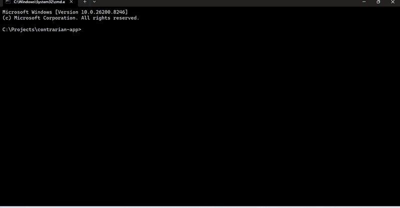
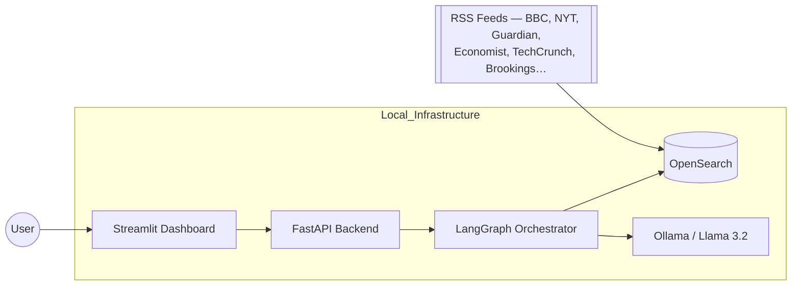

# ⚖️ Agentic-Contrarian

**Most AI finds the consensus. This one challenges it.**

Agentic-Contrarian is a local, privacy-first multi-agent RAG pipeline that reads global news, detects editorial blind spots, and generates a structured contrarian briefing — with every claim traced back to a real source.

> *"It doesn't summarise the news. It audits it."*

---

## 📺 Demo

[](docs/Demo.gif)

> The v2.0 demo will show: clickable citations · evidence mapping with stance badges · PDF export · Dev mode toggle.

---

## What's new in v2.0

| Improvement | Detail |
|---|---|
| ✅ Clickable citations | Every `[NEWS_X]` in the report links to the real source URL |
| ✅ Hallucination guard | Auditor drops off-topic articles before the LLM ever sees them |
| ✅ Stance classification | Title + body analysed separately — detects mixed-stance articles |
| ✅ PDF export | Full briefing: report + evidence table + friction points, downloadable |
| ✅ Domain-agnostic pipeline | Works on any topic — no hard-coded domains or example queries |
| ✅ Evidence Mapping tab | Browse every retrieved article, filtered by stance, with source links |
| ✅ Developer mode | Debug tab hidden by default; enable with `DEV_MODE=1` or `?dev=1` |
| ✅ Relevance gate | 40% keyword-match threshold + exact OpenSearch query (no fuzzy noise) |

---

## Why this exists

Mainstream RAG systems are optimised for agreement — they retrieve the most popular view and amplify it. This creates three problems:

1. **Echo chambers** — consensus sources dominate retrieval
2. **Hidden risk** — dissenting signals get buried by relevance scoring
3. **Unverifiable claims** — LLMs hallucinate sources users can't check

Agentic-Contrarian addresses all three: it actively seeks non-consensus sources, classifies stance before ranking, and cites every claim with a real URL.

---

## How it works

```
User query
    │
    ▼
┌─────────────────────────────────────────────────────┐
│  Researcher Node                                     │
│  Expands query into 13 variants across 9 categories  │
│  (mainstream, opinion, trade, analyst, skeptical…)   │
│  Deduplicates by URL + title                         │
└─────────────────┬───────────────────────────────────┘
                  │ evidence pool (up to 40 articles)
                  ▼
┌─────────────────────────────────────────────────────┐
│  Auditor Node                                        │
│  • Relevance gate: drops articles < 40% keyword match│
│  • Stance classifier: supportive / skeptical /       │
│    critical / mixed / neutral                        │
│    (title vs body disagreement → mixed)              │
│  • Reranks by: relevance × stance diversity ×        │
│    source diversity + contrarian boost               │
│  • Extracts friction points (consensus vs dissent)   │
│  • Fills empty contrarian_evidence from pool         │
└─────────────────┬───────────────────────────────────┘
                  │ top 12 ranked, classified articles
                  ▼
┌─────────────────────────────────────────────────────┐
│  Perspective Analyst Node                            │
│  Identifies missing source types (trade press,       │
│  regional outlets, analyst notes, interviews…)       │
└─────────────────┬───────────────────────────────────┘
                  │ blind spot list
                  ▼
┌─────────────────────────────────────────────────────┐
│  Contrarian Node (Llama 3.2)                         │
│  Generates 4-section briefing:                       │
│  Mainstream Narrative / Contrarian View /            │
│  Evidence / Caveats                                  │
│  Every sentence must cite a source_id                │
│  Post-generation topic check guards off-topic output │
└─────────────────────────────────────────────────────┘
```

---

## System architecture



---

## Output format

Every query returns a structured 4-section briefing:

```
## Mainstream Narrative
What most retrieved sources say about the topic [NEWS_1 · BBC].

## Contrarian View
Non-consensus interpretation from skeptical/critical sources [NEWS_3 · ForeignPolicy].

## Evidence
Specific facts supporting the contrarian view [NEWS_2 · TechCrunch].

## Caveats
Missing evidence, underrepresented stances, and reasons the contrarian view may be wrong.
```

Citations are clickable links in the dashboard. The full briefing exports as a structured PDF.

---

## Tech stack

| Component | Technology |
|---|---|
| Multi-agent orchestration | [LangGraph](https://github.com/langchain-ai/langgraph) |
| LLM — local, zero-cost | [Ollama](https://ollama.com/) — Llama 3.2 |
| Vector + keyword search | [OpenSearch](https://opensearch.org/) |
| API layer | [FastAPI](https://fastapi.tiangolo.com/) + Uvicorn |
| Frontend | [Streamlit](https://streamlit.io/) — dark mode |
| News ingestion | RSS feeds — no API key required |
| Containerisation | Docker |

---

## Quick start

### Prerequisites

| Tool | Required |
|---|---|
| Python 3.11 | ✅ |
| Docker Desktop | ✅ (OpenSearch + Postgres) |
| [Ollama](https://ollama.com/) | ✅ |

### One-time setup

```bash
git clone https://github.com/PreethaRaj/Agentic-Contrarian.git
cd Agentic-Contrarian
```

Then run the setup script — it creates the venv, installs all dependencies, pulls the LLM, starts Docker, and ingests the first batch of news:

```bat
setup.bat
```

> `setup.bat` automates: `python -m venv venv` → `pip install -r requirements.txt` → `docker compose up -d` → `ollama pull llama3.2` → `python ingest.py`

### Run

After setup, launch both the backend and dashboard in one step:

```bat
start.bat
```

> `start.bat` opens two terminal windows automatically:
> - **Terminal 1** — FastAPI backend on `http://localhost:8000`
> - **Terminal 2** — Streamlit dashboard on `http://localhost:8501`

Verify the backend is alive: `http://localhost:8000/health` → `{"status":"ok"}`

Then open `http://localhost:8501`, enter any topic, click **Launch Deep-Dive Investigation**.

### Refresh the news index

Re-run any time to pull the latest articles into OpenSearch:

```bat
venv\Scripts\activate
python ingest.py
```

### Developer mode (shows debug tab)

```bat
set DEV_MODE=1
streamlit run app\ui\dashboard.py
```
Or append `?dev=1` to the dashboard URL without restarting.

---

## How to pick a query

Agentic-Contrarian works on **any topic** — the pipeline is domain-agnostic.

The best queries come directly from the news sources the system reads.
**Try this:** open any of the supported RSS feeds below, pick a headline that interests you,
and paste the topic into the dashboard. The system will surface whether there is a contrarian.
Example : "Britain’s Electorate Is ‘Splintering.’ Can Its System Stand the Strain?"

view hiding beneath the mainstream coverage.

| Source | URL |
|---|---|
| BBC World | https://feeds.bbci.co.uk/news/world/rss.xml |
| The Guardian | https://www.theguardian.com/world/rss |
| New York Times | https://rss.nytimes.com/services/xml/rss/nyt/World.xml |
| TechCrunch | https://techcrunch.com/feed/ |
| The Economist | https://www.economist.com/the-world-this-week/rss.xml |
| Foreign Policy | https://foreignpolicy.com/feed/ |
| Brookings | https://www.brookings.edu/feed/ |
| Channel NewsAsia | https://www.channelnewsasia.com/rss-feeds/8395904 |

> **Tip:** Queries with visible tension in the headline work best —
> e.g. *"X is booming despite Y"*, *"Country splits on Z"*, *"Experts warn about W"*.
> These already signal that a contrarian view likely exists in the index.

---

## News sources ingested

| Category | Sources |
|---|---|
| Mainstream | BBC World, New York Times, The Guardian |
| Opinion | The Economist, Foreign Policy |
| Trade/Tech | TechCrunch |
| Analyst | Brookings Institution, CFR |
| Regional | Channel NewsAsia, Sky News |

To add sources: open `ingest.py` and add RSS URLs to the `FEEDS` dictionary.

---

## Project structure

```
Agentic-Contrarian/
├── app/
│   ├── agents/
│   │   ├── nodes/
│   │   │   ├── researcher.py    # Query expansion (13 variants, 9 categories)
│   │   │   ├── auditor.py       # Relevance gate + stance classifier + reranker
│   │   │   ├── perspective.py   # Blind spot detection
│   │   │   └── contrarian.py    # Briefing generation with citation enforcement
│   │   ├── graph.py             # LangGraph wiring
│   │   └── state.py             # AgentState TypedDict
│   ├── api/main.py              # FastAPI endpoints
│   ├── config.py                # All tuneable constants (thresholds, signals, variants)
│   └── ui/dashboard.py          # Streamlit dashboard
├── ingest.py                    # Standalone RSS ingest — no Airflow required
├── tests/test_pipeline.py       # 30 tests, 7 domains, no live services needed
├── docker-compose.yml
├── requirements.txt
└── README.md
```

---

## Configuration

All pipeline tuneables live in `app/config.py` — edit once, affects the whole pipeline:

```python
MIN_RELEVANCE_SCORE = 0.40   # raise to reduce noise; lower to increase recall
TOP_K_RERANKED      = 12     # articles passed to LLM
MIN_CONTRARIAN      = 2      # minimum skeptical articles before weak-signal flag
SOURCE_CATEGORIES   = [...]  # query expansion variants
SKEPTICAL_SIGNALS   = {...}  # stance classification vocabulary
```

---

## Limitations

- **Inference latency:** Llama 3.2 on CPU: 60–180s per query. GPU or cloud LLM reduces this dramatically.
- **Index freshness:** Index is static until you re-run `python ingest.py`. No live feed polling.
- **Contrarian depth:** Limited by what RSS feeds actually publish. Niche topics may return weak contrarian coverage.
- **No auth or rate limiting:** Not production-ready for public deployment as-is.

---

## Roadmap

- [ ] Streaming SSE output — word-by-word dashboard updates
- [ ] RAGAS evaluation node — automated faithfulness + contrarian-ness scoring
- [ ] Scheduled ingest — cron/Airflow for automatic index refresh
- [ ] GPU-optimised inference config
- [ ] Additional feed categories: academic preprints, financial filings, government reports

---

## 5-day learning path

New to agentic RAG? Follow this:

| Day | File | What to learn |
|---|---|---|
| 1 | `ingest.py` | How RSS feeds are chunked, vectorised, and indexed |
| 2 | `app/agents/nodes/researcher.py` | Query expansion — why 13 variants, not 1 |
| 3 | `app/agents/nodes/auditor.py` | Relevance gating, stance classification, reranking |
| 4 | `app/agents/nodes/contrarian.py` | Prompt engineering — how to enforce citation grounding |
| 5 | `app/config.py` | Tune the pipeline — change thresholds, observe output differences |

---

<div align="center">
  <sub>LangGraph · OpenSearch · FastAPI · Ollama · Streamlit · Python 3.11</sub>
  <br/>
  <sub>Built locally. Runs privately. Cites everything.</sub>
</div>
